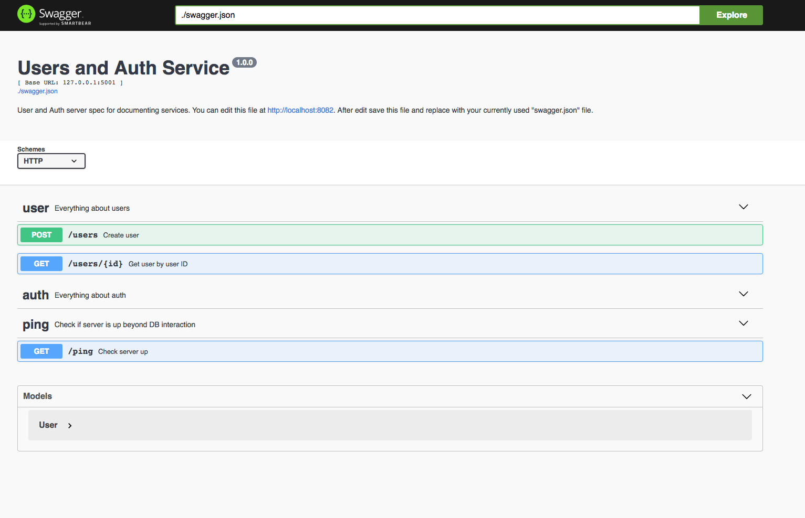
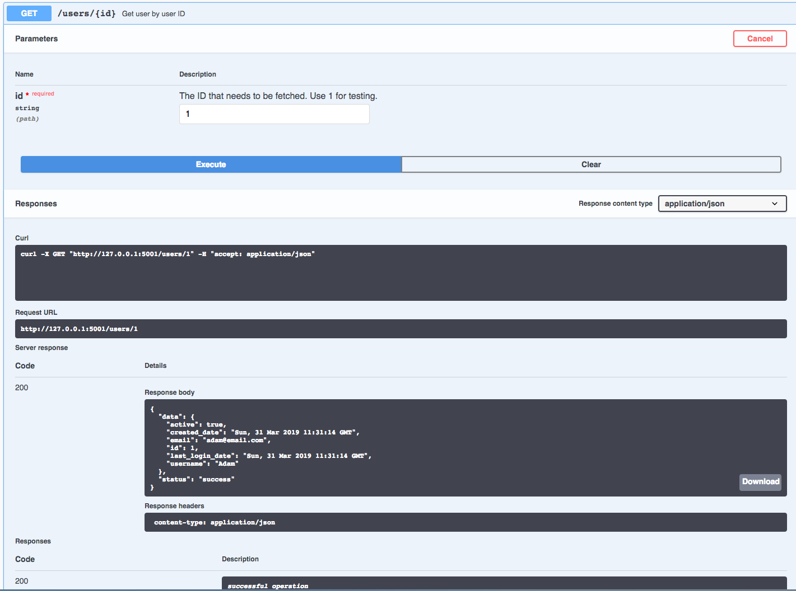

# microservice_backend

## Commands list:

##### Check code style before each new commit!

Run code style test:

`docker-compose -f docker-compose-dev.yml run backend flake8 project`

Build the images:

`docker-compose -f docker-compose-dev.yml build`

Build & run the containers:

`docker-compose -f docker-compose-dev.yml up -d --build`

Recreate the database:

`docker-compose -f docker-compose-dev.yml run backend python manage.py recreate_db`

Seed the database with initial values:

`docker-compose -f docker-compose-dev.yml run backend python manage.py seed_db`

Run the tests:

`docker-compose -f docker-compose-dev.yml run backend python manage.py test`

Run the tests with code coverage:

`docker-compose -f docker-compose-dev.yml run backend python manage.py test_coverage`

Stop the container:

`docker-compose -f docker-compose-dev.yml stop`

Stop and remove container:

`docker-compose -f docker-compose-dev.yml down`

Force a build

`docker-compose -f docker-compose-dev.yml build --no-cache`

Access PostgreSQL via psql?

`docker-compose -f docker-compose-dev.yml exec users-db psql -U [YOUR NAME: usually postgres or admin]`

## Endpoints:

`localhost:5001/user`: [GET] - get all users

`localhost:5001/user`: [POST] - add new user

`localhost:5001/user/[<id>]` [GET] - get user with id if exists

`localhost:5001/admin`: [GET] - get all admins

`localhost:5001/` [GET] - empty {}

`localhost:5001/ping` - [GET] - to check if application is on in case of DB problems

`localhost:8081/` - Swagger UI, API currently used endpoints

`localhost:8082/` - Swagger Editor, help edits Swagger UI config directly (keep in mind Yaml -> Json conversion)

## Data:
User:
* id (autoincrement, primary key)
* username
* email
* password
* active (default True)
* created_date
* last_login_date

Admin:
* id (autoincrement, primary key)
* username
* email
* password
* active
* created_date
* last_login_date

## Configs:
* Development
* Production
* Testing

## Flake8:
* 120 max line length

## Tagging commit messages and changesets:
* [NEW FEATURE]: A new feature (also small additions). Most likely it will be an added feature, but it could also be removed
* [BUGFIX]: A fix for a bug
* [API]: An API has changed, methods or classes have been added or removed; method signatures or return types have changed
* [PC]: Anything not covered by the above categories, e.g. coding style cleanup, code refactoring

## For Code Review purpose, to check differences of pull request locally / add changes to pull request:
* locally checkout to master:

`git checkout master`

* fetch from remote:

`git fetch origin`

* checkout pull-request branch locally:

`git checkout -b [PULL_REQUEST_BRANCH_NAME] origin/[PULL_REQUEST_BRANCH_NAME]`

* in case of some new changes: *git add ..., git commit -m ...*

`git push origin` *in case of message "fatal: The upstream branch of your current branch does not match..." use:*

`git push origin HEAD:[PULL_REQUEST_BRANCH_NAME]`

## SwaggerUI

